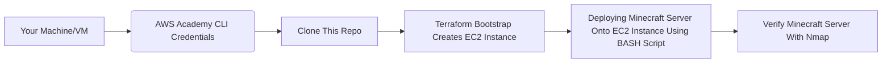

# CS312-Project2
## Background
### Purpose
The purpose of this project is to automate the creation of a Minecraft Java Edition Server (provisioning, configuration, and setup) on an AWS EC2 Instance **without** ever accessing the AWS Management Console. Though, except for accessing the AWS Learner Lab to start the Lab and to retrieve the AWS Academy CLI Credentials.

### How It Works
The deployment of the Minecraft Java Edition Server is an automated infrastructure pipeline that will: use Terraform to provision the AWS resources, and a BASH script to SSH into the created EC2 Instance and set up and install the Minecraft server. Upon successful completion, the server is verified using Nmap:

`nmap -sV -Pn -p T:25565 <instance_public_ip>`

## Repository Structure
```
CS312-Project2/
|   install.sh
|   README.md
|   |
+---Scripts
|   |   bootstrap-ec2.sh
|   |   deployment.sh
|   |   destroy_Terra.sh
|   |
|   ---Key
+---Terraform
|   |   .terraform.lock.hcl
|   |   dev-key.tf
|   |   ec2.tf
|   |   main.tf
|   |   networks.tf
|   |   outputs.tf
|   |   variables.tf
|
---Testing
        test-re-mc.sh
        test-server.sh
```
## Pipeline Diagram


## Requirements
- Git winget Tool
- Ubuntu Environment or WSL
- AWS CLI
- Terraform
- Nmap

## Installing the Requirements
Open your command line interface. On Windows is called Command Prompt, and Terminal for Linux users.

### Installing Git winget Tool
- For [Windows](https://git-scm.com/install/windows):
     - Run the following installation command:
  ```bash
   winget install --id Git.Git -e --source winget
   ```
- For [Ubuntu](https://git-scm.com/book/en/v2/Getting-Started-Installing-Git):
     - Run the following installation command:
  ```bash
  sudo apt install git-all
  ```
- Verifying Installation:
```bash
git --version
```

---
### [Installing WSL](https://learn.microsoft.com/en-us/windows/wsl/install) (OPTIONAL For Ubuntu Users)
- Run the following installation command:
```bash
wsl --install
```

- Verify WSL is installed:
```bash
wsl --version
```
- Configure WSL enable Linux-style file permissions:
```
sudo vim /etc/wsl.conf
```
  - Press `i` on the keyboard, and the bottom left of the terminal now says `INSERT`.
  - Copy in:
   ```bash
   [automount]
   options = "metadata"
   ```
   - Then hit `Esc` and type `:` using `shift + ;`.
   - Then type `wq` and hit `Enter`.
Without this, the `chmod` command will not make the correct file permission settings. This is a problem as we need use the `.pem` private key with proper `400` or `600` file permissions to `ssh`.

---
### [Installing AWS CLI](https://docs.aws.amazon.com/cli/latest/userguide/getting-started-install.html)
- For those using WSL, run the following command first:
```bash
wsl
```
We will be using AWS CLI commands in our Ubuntu interface, so it has to be installed in our WSL.

- Then run the command:
```bash
sudo apt update
sudo apt install unzip
curl "https://awscli.amazonaws.com/awscli-exe-linux-x86_64.zip" -o "awscliv2.zip"
unzip awscliv2.zip
sudo ./aws/install
```
This will update and install `unzip` so that we can later unzip the `AWSCLI` compressed folder. `curl` is then used to install the `AWSCLI` compressed folder, then unzipped with `unzip`. Finally, installing AWS locally on our machine.

- Verify AWS CLI is installed:
```bash
aws --version
```

- You should see something similar to:

`aws-cli/2.34.64 Python/3.14.5 Linux/6.18.33.1-microsoft-standard-WSL2 exe/x86_64.ubuntu.24`

---
### [Installing Terraform](https://developer.hashicorp.com/terraform/tutorials/aws-get-started/install-cli)
- For those using WSL, run the following command first:
```bash
wsl
```
We will be using Terraform commands in our Ubuntu interface, so it has to be installed in our WSL.

 - Run the following command:
```bash
wget -O - https://apt.releases.hashicorp.com/gpg | sudo gpg --dearmor -o /usr/share/keyrings/hashicorp-archive-keyring.gpg
echo "deb [arch=$(dpkg --print-architecture) signed-by=/usr/share/keyrings/hashicorp-archive-keyring.gpg] https://apt.releases.hashicorp.com $(grep -oP '(?<=UBUNTU_CODENAME=).*' /etc/os-release || lsb_release -cs) main" | sudo tee /etc/apt/sources.list.d/hashicorp.list
sudo apt update && sudo apt install terraform
```
---
### [Installing Nmap](https://medium.com/@orangsederhana/running-nmap-on-wsl-windows-10-f7716cdccfc7)
- For those using WSL, run the following command first:
```bash
wsl
```
- Run the following command:
```bash
sudo apt update && sudo apt install nmap -y
```
- Verify Nmap is Installed:
```bash
nmap --version
```
---
## How to Run This Automation
### Step 1: Setting Up The AWS Credentials
We will need the AWS Credentials found in the [AWS Academy Learner Lab](https://www.awsacademy.com/vforcesite/LMS_Login)
1. Start the AWS Learner Lab 
   - Log in to your AWS Academy and access the AWS Academy Learner Lab.
   - Click 'Start Lab'.
   - Once the `red` dot turns `green`, click 'AWS Details'.
   - Next to 'AWS CLI:' click `SHOW` (Stay on this page, we will need this for the next step)
     


2. Copy the AWS CLI Credentials Into Our Local Machine
   >NOTE: You will copy all the content in `SHOW` into '~/.aws/credentials'.

   - Use the following command:
   ```bash
   mkdir ~/.aws
   sudo vim ~/.aws/credentials
   ```
   Make the `.aws` folder to store the AWS Credentials, this is the default credentials path `AWS CLI` will look for.
   
   - Press `i` on the keyboard, and the bottom left of the terminal now says `INSERT`.
   - Copy the AWS CLI credentials that we found next to 'AWS CLI:'.
   - When copied over, the format should look something like:
        ```bash
        [default]
        aws_access_key_id=YOUR_ACCESS_KEY
        aws_secret_access_key=YOUR_SECRET_KEY
        aws_session_token=YOUR_SESSION_TOKEN
        ```
   - In addition to this file, add the default region:
        ```bash
        region=us-east-1 #use your preferred region
        ```
   - Then hit `Esc` and type `:` using `shift + ;`.
   - Then type `wq` and hit `Enter`.
4. Verify if the AWS credentials have been properly stored locally and are accessible by AWS CLI.
   - Run the command:
     ```bash
     aws sts get-caller-identity
     ```
---
### Step 2: Cloning This Repository
In your Command Line Interface, move to your desired folder location to clone this Repository

- Use the `cd` command followed by the path to your folder location:

```bash
cd /path/to/folder
```

-  Now use the `git clone` command:

```bash
git clone https://github.com/Angela0wu0/CS312-Project2.git
```

- Access the cloned repository with:

```bash
cd CS312-Project2
```
### Step 3: Start the Automation
- Start the Deployment Script:
```bash
./install.sh
```
>This script will run `bootstrap-ec2.sh` and `deployment.sh` script. `bootstrap-ec2.sh` will create the EC2 Instance through initializing Terraform in the `Terraform` folder. `deployment.sh` will then SSH into the created EC2 Instance and run a set of commands to set up and install the Minecraft Server. It will also create a `minecraft.service' to ensure auto-start upon boot, and will have been properly configured to close properly upon stop/shutdown. 

---
### Step 4: Verify Successful Deployment
- Run the script:
```bash
./Testing/test-server.sh
```
- Nmap scan should show port `25565` open for `Minecraft`, followed by the version numbers and how many people are on the server.

---
### Step 5: Verify Minecraft Auto-start on reboot
- Run the script:
```bash
./Testing/test-re-mc.sh
```
- Then run:
```bash
./Testing/test-server.sh
```
- The port `25565` for `Minecraft` should no longer say open
- Wait a couple of seconds or a minute, depending on your internet speed, for the EC2 Instance to fully reload, before rerunning:
```bash
./Testing/test-server.sh
```
- Port `25565` for `Minecraft` should be `open` again.

---
## Access the Minecraft Server
1. Initial Setup 
   - Download [Minecraft](https://www.minecraft.net/en-us/download)
   - Open the Minecraft Launcher and Sign In
   - Click on Minecraft Java Edition on the left-hand side of the Minecraft Launcher
   - Click **Play**
2. Connecting to the Server
   - Click on `Multiplayer`
   - Then `Add Server`:
      - Server Name: `Minecraft Server`
      - Server Address: `<Public-IP>`
       > **Note:** Replace `<Public-IP>` with the instance's Public IP. The IP can be found in `/Scripts/config.env`, re-running the `./Testing/test-server.sh` script, or in the AWS Management Console 
       
## Deleting the Minecraft Server
> [!IMPORTANT]
> The script provided will ***Terminate*** the EC2 Instance. This is non-reversible. Please use this with caution! 
- The deletion of the Minecraft Server Script:
  ```bash
  ./Scripts/destroy_Terra.sh
  ```
>

---
# Sources
[Installing WSL]https://learn.microsoft.com/en-us/windows/wsl/install  
[Windows:Installing Git]https://git-scm.com/install/windows  
[Ubuntu:Installing Git]https://git-scm.com/book/en/v2/Getting-Started-Installing-Git  
[Installing AWS CLI]https://docs.aws.amazon.com/cli/latest/userguide/getting-started-install.html  
[Installing Terraform]https://developer.hashicorp.com/terraform/tutorials/aws-get-started/install-cli  
[Installing Nmap]https://medium.com/@orangsederhana/running-nmap-on-wsl-windows-10-f7716cdccfc7  
[Minecraft Installation]https://www.minecraft.net/en-us/download  
[Terraform Code Formatting]https://developer.hashicorp.com/terraform/language/style  
[Creating Keys With TerraForm]https://registry.terraform.io/providers/hashicorp/aws/latest/docs/resources/key_pair
[Running Terraform]https://developer.hashicorp.com/terraform/cli/commands


