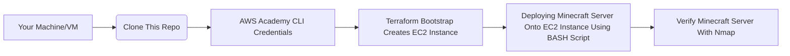

# CS312-Project2
## Background
### Purpose
The purpose of this project is to automate the creation of a Minecraft Java Edition Server (provisioning, configuration, and setup) on an AWS EC2 Instance **without** ever accessing the AWS Management Console. Though, except for accessing the AWS Learner Lab to start the Lab and to retrieve the AWS Academy CLI Credentials.

### How It Works
The deployment of the Minecraft Java Edition Server is an automated infrastructure pipeline that will: use Terraform to provision the AWS resources, and a BASH script to SSH into the created EC2 Instance and set up and install the Minecraft server. Upon successful completion, the server is verified using Nmap:

`nmap -sV -Pn -p T:25565 <instance_public_ip>`

## Repository Structure
```
CS312-Project2/
|   install.sh
|   README.md
|   |
+---Scripts
|   |   bootstrap-ec2.sh
|   |   deployment.sh
|   |   destroy_Terra.sh
|   |
|   ---Key
+---Terraform
|   |   .terraform.lock.hcl
|   |   dev-key.tf
|   |   ec2.tf
|   |   main.tf
|   |   networks.tf
|   |   outputs.tf
|   |   variables.tf
|
---Testing
        test-re-mc.sh
        test-server.sh
```
## Pipeline Diagram


## Requirements
- Git
- Ubuntu Environment or WSL
- AWS CLI
- Terraform
- Nmap

## Installing the Requirements
Open your command line interface. On Windows is called Command Prompt, and Terminal for Linux users.

### Installing Git


### Installing WSL (OPTIONAL For Ubuntu Users)
Run the following command:

`wsl --install`

Verify the installation by running the following command:

`wsl --version`

### Installing AWS CLI
For those using WSL, run the following command first:

`wsl`

Then run the following command:

```bash
curl "https://awscli.amazonaws.com/awscli-exe-linux-x86_64.zip" -o "awscliv2.zip"
unzip awscliv2.zip
sudo ./aws/install
```

Verify if AWS CLI is installed properly by running the following command:

`aws --version`

You should see something similar to:

>aws-cli/2.34.64 Python/3.14.5 Linux/6.18.33.1-microsoft-standard-WSL2 exe/x86_64.ubuntu.24

### Installing Terraform

### Installing Nmap


## Connecting to the Minecraft Server
### Step 1: Cloning This Repository
1. In your Command Line Interface, move to your desired folder location to clone this Repository. Use the `cd` command followed by the path to your folder location:

`cd /path/to/folder`

2. Now use the `git clone` command:

`git clone https://github.com/Angela0wu0/CS312-Project2.git`

3. Access the cloned repository with:

`cd CS312-Project2`

### Step 2: AWS Credentials  
We will need the AWS Credentials found in the [AWS Academy Learner Lab](https://www.awsacademy.com/vforcesite/LMS_Login)
1. Log in to your AWS Academy and access the AWS Academy Learner Lab
2. Click `Start Lab'
3. Once the red dot turns green, click 'AWS Details' 
https://developer.hashicorp.com/terraform/tutorials/aws-get-started/install-cli
